# Owl 3D Viewer

This needs Node.js/Express.js/Three.js/mongoDB
This express framework is ejs.
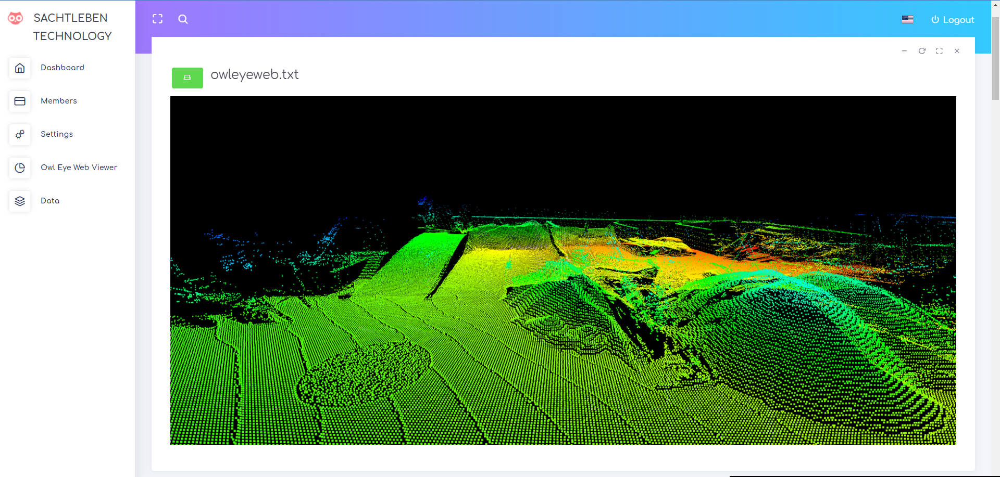

# How to run
* yarn install
* yarn start
* 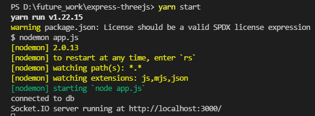
## Login Page
### Default login Information
* UserName : admin@oe-web.com
* Password : admin1234
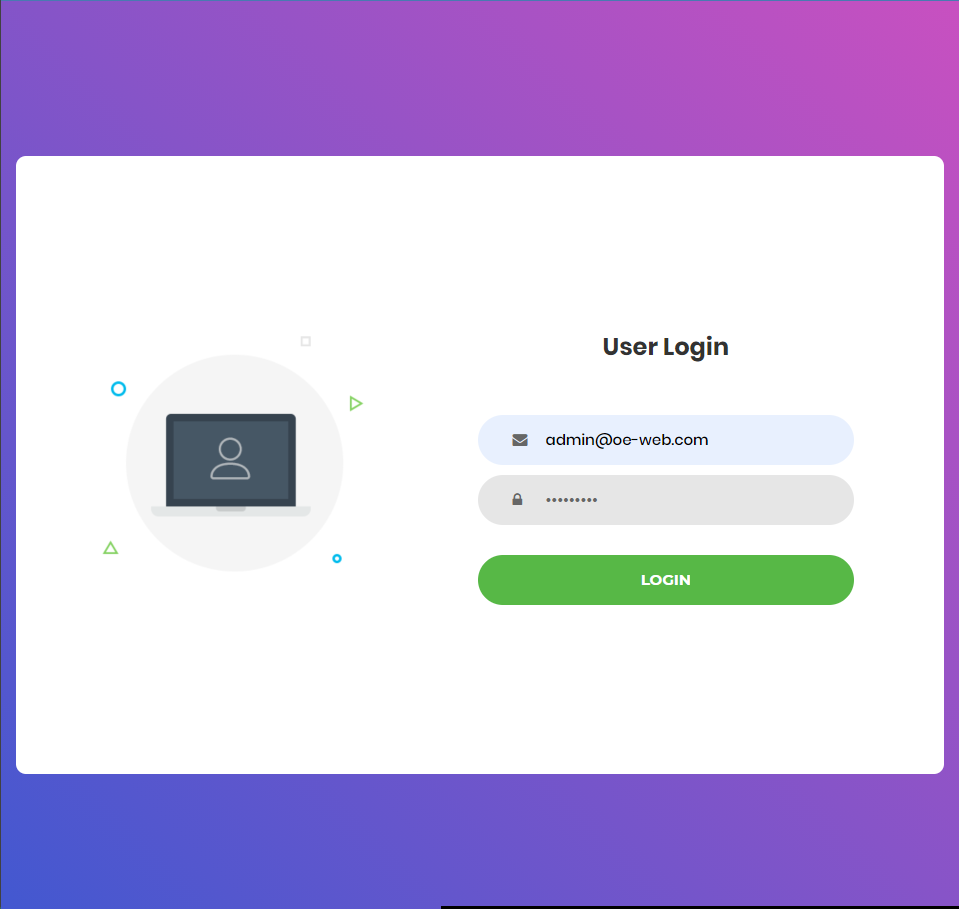

### Dashboard Page
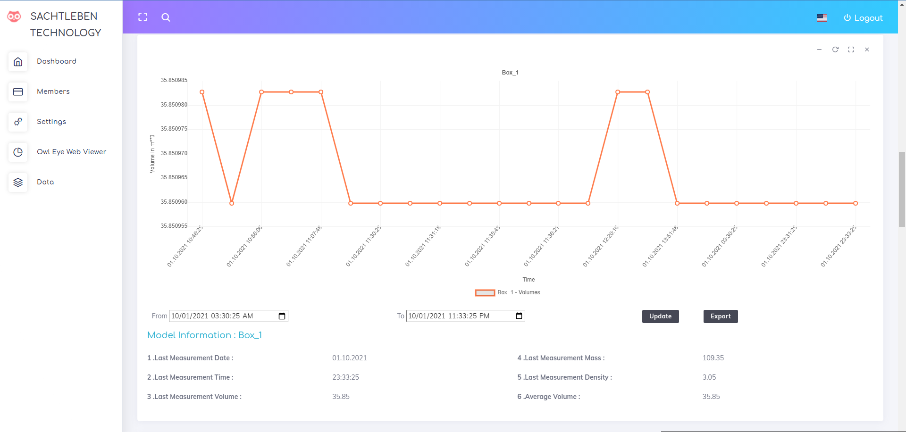
* This is owl 3d scan file from MongoDB.
* This chart is chart.js library
* http://gionkunz.github.io/chartist-js/
* Necessary Collection : 
* [Routing file](./routes/index.js)

### Members Page
* This is CRUD page
* [Routing File](./routes/users.js)
#### Read
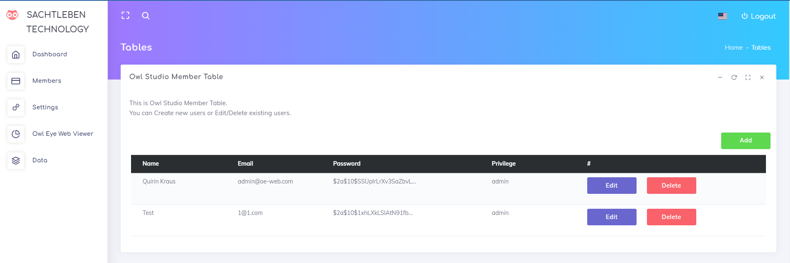

#### Create
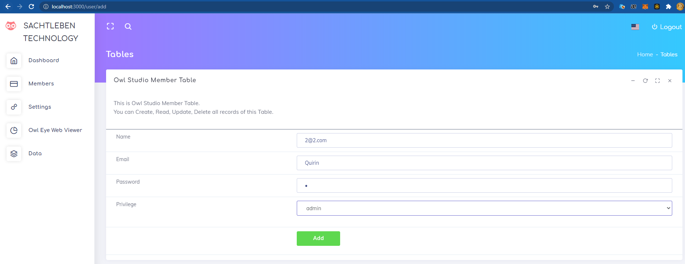
#### Update
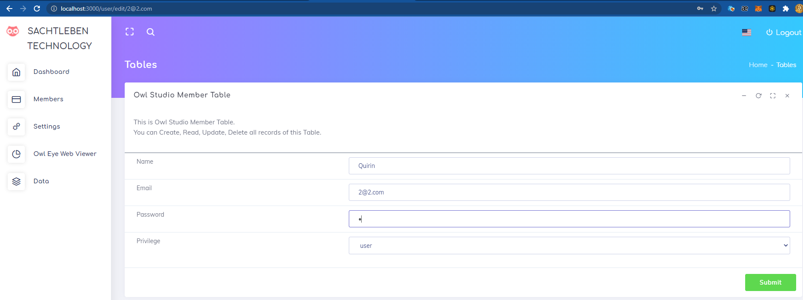
#### Delete
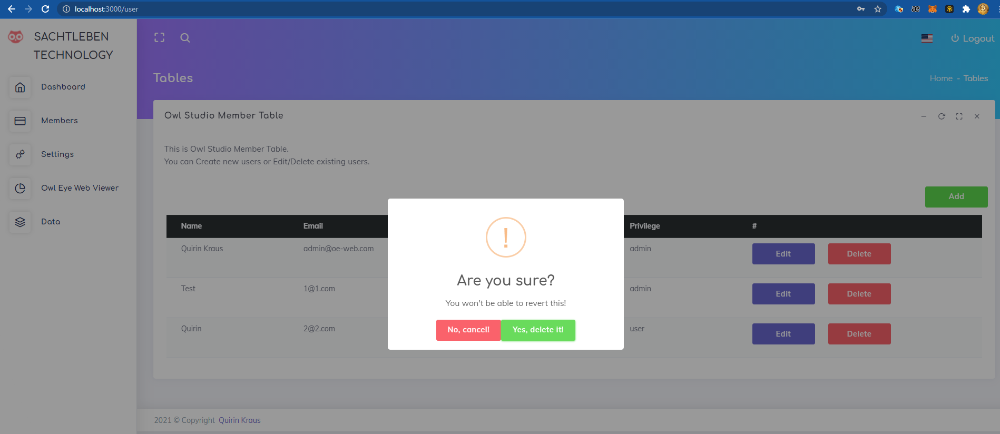

## Setting Page
[Routing](./routes/setting.js)
This is for necessary database
You can import needed database for model db from different database
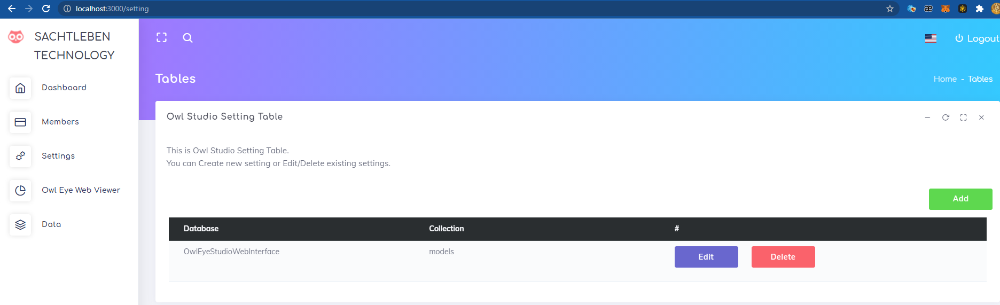

## 3D viewer Page
[Routing](./routes/index.js)
This is 3D viewer page
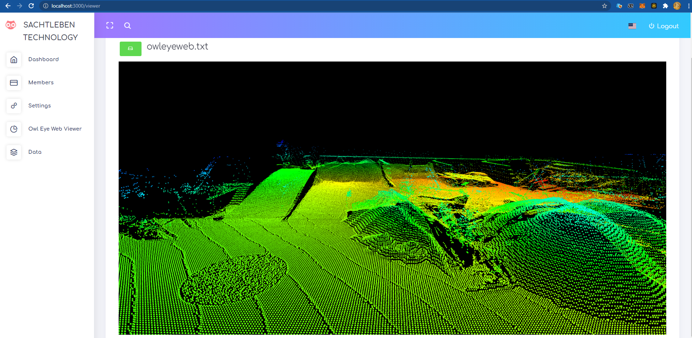

## Data Page
[Routing](./routes/data.js)
This is 3D viewer page
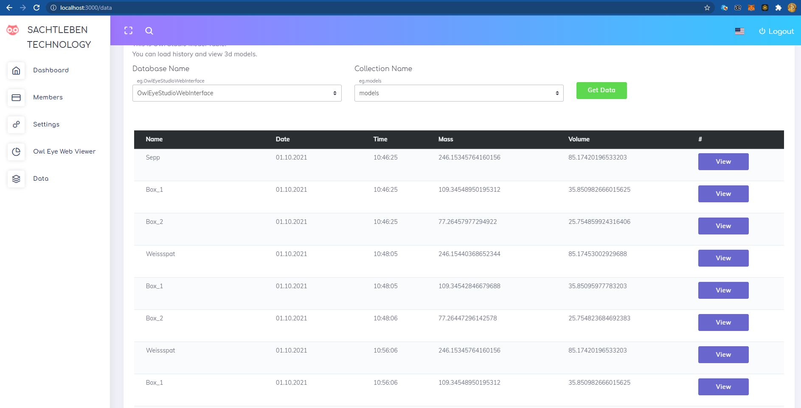
## Database Information
* Please look ./config.js if you want more information
* Database : MongoDB
* Database Name : OwlEyeStudioWebInterface

